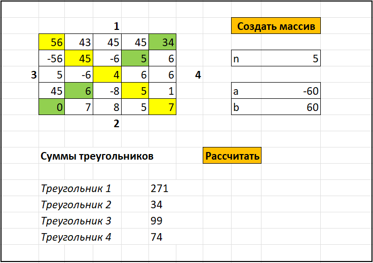

# **Решение тестового задания для WeJET**

# Установка и проверка:

* **Для запуска потребуется библиотека NumPy** 
  * Для установки пишем pip3 install numpy
  * Далее, клонируем репозиторий и запускаем main.py

# Решение тестовой задачи для начала обучения

**Описание задачи:** 

Задачу можно реализовать на любом языке программирования, выбор не принципиален.

**Требования:**

•	Создать двумерный массив, размерностью n (должна получиться квадратная матрица). У пользователя должна быть возможность указывать размерность;

•	Заполнить данный массив «рандомными» числами в диапазоне от a до b, где a – нижняя граница, b – верхняя граница. У пользователя должна быть возможность ввода данного диапазона. Также должна быть проверка, чтобы a не было больше b или равно. Выводить сообщение пользователю;

•	Необходимо рассчитать суммы чисел, которые образовались в треугольниках (верхний, нижний, левый, правый), полученного двумерного массива. Наглядно это видно в файле Excel; 

•	Числа, которые попали в диагонали, можно либо не включать в расчет или включать в каждый треугольник, куда они попали. Это остается на усмотрение программиста.

# Пример массива и отображение треугольников

